<div align="center">
  
</div>

<br/>

<div align="center">

[](https://tanish2311.github.io)&nbsp;
[](https://linkedin.com/in/tanish2311)&nbsp;
[](https://leetcode.com/ttanishh)&nbsp;
[](mailto:tanishpanchal2311@gmail.com)&nbsp;
[](https://github.com/ttanishh)


</div>

---

<table>
<tr>
<td width="55%" valign="top">

```zsh
╭─ tanish@universe  ~/career
╰─❯ cat whoami.json
{
  "name"     : "Tanish Panchal",
  "role"     : "Incoming SDE",
  "current"  : "Apple IS&T Intern 🍎",
  "college"  : "SVNIT Surat — CSE '26",
  "cgpa"     : 8.10,
  "location" : "India 🇮🇳",
  "open_to"  : ["Backend", "Full-Stack"],
  "target"   : "₹15–25 LPA",
  "status"   : "🟢 Actively looking"
}
```

```zsh
╭─ tanish@universe  ~/superpowers
╰─❯ ls -la

🍎  Big Tech production experience @ Apple
⚡  3 internships before graduation
🏆  5 hackathons — 2 podiums, 3 finals
🤖  ML models in production (85%+ acc)
📦  10GB+/day ETL at 99.9% uptime
💡  Google Developer Student Club Lead
```

</td>
<td width="45%" valign="top" align="center">


<br/><br/>

<!-- Static stat badges — always visible, no external API failures -->

-0d1117?style=flat-square&logo=apple&logoColor=F5A623)

-0d1117?style=flat-square&logo=trophy&logoColor=F5A623)

</td>
</tr>
</table>

---

## 🍎 Currently @ Apple

> **IS&T Intern · Supply Chain Innovation · Hyderabad** *(Jan 2026 – Jun 2026)*

```
┌─────────────────────────────────────────────────────────────────────────┐
│  Architecting automated demand workflow systems for Global Service       │
│  Supply Management — reducing manual overhead at international scale.   │
│                                                                          │
│  Stack: Python · SQL · Internal Apple Tooling · Data Pipelines           │
└─────────────────────────────────────────────────────────────────────────┘
```

<div align="center">

&nbsp;


</div>

---

## 🚀 Featured Projects

<div align="center">

<table>
<tr>
<td width="50%" align="center" valign="top">

### 📊 Lead Scoring System
**Careerline Education Foundation**


```
XGBoost · FastAPI · Streamlit
Feature Engineering · CRM Analytics
```

✅ **+35%** lead conversion rate  
✅ 500+ intake forms → behavior features  
✅ Interactive dashboard + explainability  

[](https://github.com/ttanishh)

</td>
<td width="50%" align="center" valign="top">

### 📧 AI Email Assistant
**Chrome Extension**


```
Java Spring Boot · Gemini API
Chrome Extension API · Maven
```

✅ **< 2s** AI-powered reply generation  
✅ One-click Gmail integration  
✅ Context-aware via Gemini API  

[](https://github.com/ttanishh)&nbsp;[](https://github.com/ttanishh)

</td>
</tr>
<tr>
<td width="50%" align="center" valign="top">

### 🔐 Kavach
**Blockchain Crime Reporting**


```
Next.js · Node.js · MongoDB
Smart Contracts · ML Microservice
```

✅ Real-time map-based reporting  
✅ Smart contracts for immutability  
✅ ML prediction microservice  

[](https://github.com/ttanishh)

</td>
<td width="50%" align="center" valign="top">

### 📦 Logistics Dashboard
**UPL — Production System**


```
Python · Power BI · ARIMA · LSTM
SAP Integration · ETL Pipelines
```

✅ **10GB+/day** ETL · **99.9%** uptime  
✅ **12% cost reduction** via anomaly detection  
✅ **500+ users** across business units  

> *Not a side project. Production.*

</td>
</tr>
</table>

</div>

---

## 🛠 Tech Stack

<div align="center">

**Languages**


**Backend & Frameworks**


**ML & Data**


**DevOps & Infra**


</div>

---

## 🏆 Hall of Records

```
┌────────────────────────────────────────────────────────────────────┐
│  🥇  GDSC Ideathon                1st  / 20 teams      2023       │
│  🥉  Mindbend Webathon            3rd  / 50+ teams     2024       │
│  🎖  GDSC Hack The Tank           Finalist / 30+ teams 2024       │
│  🎖  Odoo × Mindbend Hackathon    Finalist / 50+ teams 2025       │
│  🔐  CTF Cybersecurity Comp       Top 7 / 50+ teams   2025       │
└────────────────────────────────────────────────────────────────────┘
```

---

## 💼 Experience

<div align="center">

| | Role | Company | Impact |
|:---:|:---|:---|:---|
| 🍎 | **IS&T Intern** | Apple *(Jan–Jun 2026)* | Supply chain workflow automation · global scale |
| 📊 | **NextGen Software Intern** | UPL *(May–Jul 2025)* | 10GB+/day ETL · 99.9% uptime · 12% cost cut |
| 🤖 | **ML Intern** | Sahana Systems *(Jun–Aug 2024)* | CNN classifier · 85% accuracy · 10K+ records |

</div>

---

## 👥 Leadership

<div align="center">

| Role | Org | Duration |
|:---|:---|:---|
| 🌐 **Community Lead** | Google Developer Student Clubs, SVNIT | 2024 – 2025 |
| 🎓 **Mentor & Lead Coordinator** | Nexus — Dept. of CSE, SVNIT | 2023 – 2025 |

</div>

---

## 🌐 Connect

<div align="center">

[](https://tanish2311.github.io)&nbsp;
[](https://linkedin.com/in/tanish2311)&nbsp;
[](https://leetcode.com/ttanishh)&nbsp;
[](mailto:tanishpanchal2311@gmail.com)

<br/>

```
╔══════════════════════════════════════════════════════════════╗
║   Open to SDE-1 roles · Backend & Full-Stack · Jun 2026     ║
║             Let's build something at scale.                  ║
╚══════════════════════════════════════════════════════════════╝
```

</div>
